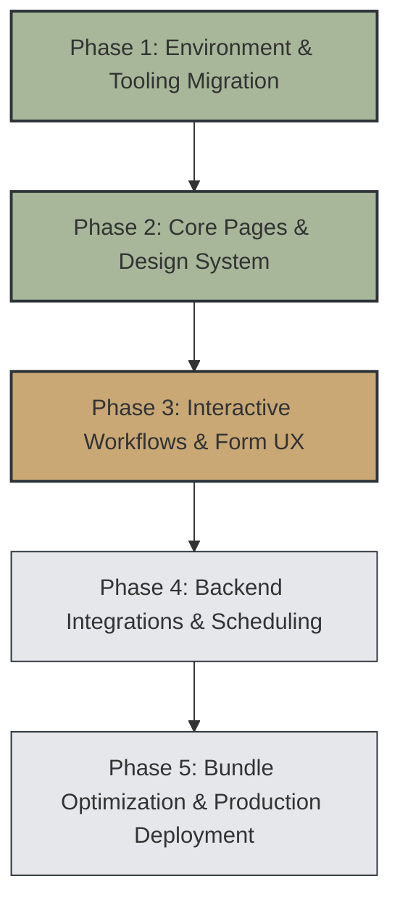

# Project Progress & Implementation Status: RD Trauma Healing

**Location:** `e:\rd-trauma-healing`  
**Last Updated:** 2026-09-24  
**Current Status:** Build & Typecheck Clean (Local npm environment functional)

---

## 1. Executive Summary

The **Rebecca Davies Trauma Healing** web application is a trauma-informed therapeutic practice website. Built with React 19, Vite, Tailwind CSS v4, Wouter for routing, Framer Motion for gentle micro-animations, and Radix UI primitives. It features a tranquil, accessible design system tailored for individuals seeking somatic, EMDR, and relational trauma support.

The project was recently decoupled from external workspace catalog dependencies and Replit plugins to run natively via standard `npm` workflows.

---

## 2. Implementation Plan

### Phase Breakdown

- **Phase 1: Environment & Tooling Decoupling (Completed)**
  - Transition from Replit pnpm workspace catalog dependencies to standard local `npm` management.
  - Configure root and package `scripts`, `tsconfig.json`, `.npmrc`, and `vite.config.ts`.
  - Ensure zero build/runtime dependencies on proprietary Replit plugins.

- **Phase 2: Core UX, Routing & Trauma-Informed Aesthetics (Completed)**
  - Establish custom calming design palette:
    - Cream background (`#FAF6F0`)
    - Deep slate typography (`#2C3339`)
    - Sage green accents (`#A8B79A`)
    - Mauve/lavender highlights (`#7D6485`)
    - Warm sand gold accents (`#C9A876`)
  - Full multi-page architecture with gentle page transitions (Wouter + Framer Motion).
  - Implement pages: Home, About, Services, Testimonials, FAQ, Contact & Consultation.

- **Phase 3: Interactive Workflows & Form Polish (Current / In Progress)**
  - Interactive consultation booking flow and contact inquiry form.
  - Real-time client-side validation and confirmation feedback states.
  - Accessible accordions for therapeutic FAQs and service details.

- **Phase 4: Backend Integrations & Real-Time Scheduling (Pending)**
  - Email transport service (e.g., Resend, SendGrid, or serverless API endpoint) to deliver contact submissions.
  - Calendar/booking integration (e.g., Cal.com embed, Calendly widget, or direct booking API).
  - Dynamic SEO head management (OpenGraph tags, page titles, structured data for healthcare/therapy providers).

- **Phase 5: Performance Optimization, Testing & Launch (Pending)**
  - Code-splitting with `React.lazy()` for route chunks to optimize initial bundle size below 500 kB.
  - Automated test suite (Vitest for component tests, Playwright for end-to-end user journeys).
  - Production deployment pipeline and asset optimization.

---

## 3. Completed Tasks vs. Pending Tasks

### Completed Tasks

- [x] **NPM Environment Migration**
  - Configured root `package.json` with scripts delegating to `artifacts/rd-trauma-healing` (`dev`, `build`, `start`, `postinstall`).
  - Added `.npmrc` with `legacy-peer-deps=true` for smooth React 19 compatibility.
  - Replaced catalog references in `artifacts/rd-trauma-healing/package.json` with concrete npm version ranges.
  - Cleaned `artifacts/rd-trauma-healing/vite.config.ts` to remove Replit dev banner/cartographer/error plugins, adding resilient environment variable fallback (`PORT=5173`, `BASE_PATH=/`).
  - Updated `artifacts/rd-trauma-healing/tsconfig.json` with `esModuleInterop: true` and included Vite config.
- [x] **Multi-Page Site Architecture (`rd-pages.tsx`)**
  - **Home:** Practice overview, core therapeutic pillars, client reflection preview, call to consultation.
  - **About:** Practitioner background (Rebecca Davies), credentials, clinical philosophy, safety commitment.
  - **Services:** Somatic Experiencing, EMDR, Nervous System Regulation, 1-on-1 session details, fee guidance.
  - **Testimonials:** Client stories with consent notice and emotional safety guidelines.
  - **FAQ:** Collapsible accordions addressing first-session anxiety, confidentiality, session frequency, online vs in-person.
  - **Contact & Consultation:** Consultation booking flow, contact note form with success feedback state, WhatsApp & email channels.
- [x] **Accessibility & Motion Design**
  - Respects user motion preferences with `useReducedMotion()`.
  - Accessible focus rings, semantic landmark elements, contrast-checked color tokens.
- [x] **Brand Assets, Social Icons & Contact Integration**
  - Replaced all default Replit branding and red-box favicon with the website's high-resolution logo (`/rd-trauma-healing-logo.png`).
  - Generated multi-resolution favicon suite (`favicon.ico`, `favicon-16x16.png`, `favicon-32x32.png`, `favicon-48x48.png`, `apple-touch-icon.png`, and self-contained data-URI `favicon.svg`) ensuring browser tab icon display across all browsers.
  - Configured Open Graph (`og:image`, `og:title`, `og:description`) and Twitter/X card preview metadata showing title "RD Trauma Healing", description "Trauma-informed therapy and wellbeing support with Rebecca Dakin.", and logo preview.
  - Added official social media icons (Instagram, Facebook, TikTok) in the footer with direct external new-tab links.
  - Updated direct contact details across footer and contact pages: email `wellbeingsessions@traumahealingwithrebeccadakin.co.uk` (`mailto:`) and phone `07858077379` (`tel:`).
  - Added clear and attractive Pricing Section (`£50 per session` OR `BLOCK BOOK 3 X SESSIONS FOR £100!`) with a solid, high-visibility "Book a session" button visible by default.
  - Modified floating WhatsApp chat widget to use the official WhatsApp icon and target `+447858077379`, preserving original purple styling (`#7D6485`), size, and pulse animations.
- [x] **Interactive Appointment Request System & Google Sheets Integration**
  - Built full interactive calendar replacing static placeholder dates; supports month navigation, active/disabled date states, working day logic, and easy configuration via `src/lib/availability.ts`.
  - Implemented dynamic time slot picker showing available appointment times for the selected date.
  - Added session package selector with clear pricing options: Single Session (£50) vs Block Booking 3 Sessions (£100 - Save £50).
  - Designed responsive patient details intake form (Full Name, Email, Phone, Optional Note) and pre-submission live booking summary.
  - Implemented secure server-side Google Sheets integration in `src/server/google-sheets.ts` and Vite API plugin (`POST /api/appointments`) with initial "Pending" status and 10 structured columns: Submission Date/Time, Patient Name, Email, Phone, Appointment Date, Appointment Time, Session Type, Price, Message, Status.
  - Created zero-exposure architecture supporting Google Apps Script Webhooks (`GOOGLE_SHEETS_WEBHOOK_URL`), Google Cloud Service Accounts, and resilient local server backup (`data/appointments.json`). Provided `google-sheets-script.js` and `.env.example`.
- [x] **Contact Page Refinements**
  - Removed the redundant 3-column contact strip (`EMAIL`, `PHONE`, `LOCATION`) from the bottom of the contact page as requested.
  - Made the "Email Rebecca" button in the alternative contact section visible by default with a solid charcoal pill style (`bg-[#2C3339] text-[#FAF6F0] hover:bg-[#7D6485]`) and official `<Mail size={16} />` icon.
- [x] **Google Sheets MCP Server & Unified Credentials Integration**
  - Configured the Google Sheets MCP server in global Antigravity configuration ([mcp_config.json](file:///C:/Users/saqib/.gemini/config/mcp_config.json)) using `mcp-google-sheets-server`.
  - Updated [src/server/google-sheets.ts](file:///e:/rd-trauma-healing/artifacts/rd-trauma-healing/src/server/google-sheets.ts) with `resolveGoogleCredentials()` so that a single `google-service-account.json` file powers both the Antigravity MCP server and the website's live appointment booking submissions.
  - Added `*service-account*.json`, `*credentials*.json`, and `google-service-account.json` to [.gitignore](file:///e:/rd-trauma-healing/.gitignore) to protect credentials from version control.
- [x] **Typecheck & Production Build Verification**
  - Verified `tsc -p tsconfig.json --noEmit` exits with 0 errors.
  - Verified `npm run build` bundles assets to `dist/public` without build failures.
- [x] **Vercel Deployment Optimization**
  - Removed obsolete `pnpm-lock.yaml` and `pnpm-workspace.yaml` which triggered `ERR_PNPM_OUTDATED_LOCKFILE`.
  - Added root `package-lock.json` and explicit `packageManager: "npm@10.8.2"` in root `package.json`.
  - Configured `installCommand: "npm install"` in `vercel.json` for deterministic CI installs on Vercel.
  - Pushed fix commit `948c29a` to GitHub `origin main`.

### Pending Tasks

- [ ] **Contact Form Backend Integration**
  - The general contact note form can be connected to an email dispatch service (e.g. Resend, SendGrid) to deliver direct inquiries.
- [ ] **Bundle Chunking & Optimization**
  - Introduce route-level code splitting using `React.lazy` and `Suspense` in `App.tsx` to optimize vendor chunk size below 500 kB.
- [ ] **SEO & Metadata Enhancements**
  - Add per-page metadata (schema.org medical/therapist structured markup).
- [ ] **Comprehensive Test Coverage**
  - Add unit/integration tests for form inputs, navigation transitions, and accordion interactions.
  - Setup Playwright E2E tests for booking inquiry flow.

---

## 4. Custom Skills and Rules in Workspace

### Workspace Customization Root: `.agents/`

- **Rules (`.agents/rules/`):**
  - [`workspace-rules.md`](file:///e:/rd-trauma-healing/.agents/rules/workspace-rules.md): Defines active project rules including NPM exclusivity (avoiding pnpm commands), dev server configurations, and trauma-informed design & copy principles.
- **Skills (`.agents/skills/`):**
  - *Current Status:* No local workspace-specific skills defined yet.
  - *Built-in IDE Skills Available:*
    - `antigravity-guide` (`C:\Users\saqib\.gemini\antigravity-ide\builtin\skills\antigravity_guide\SKILL.md`)
    - `agy-customizations` (`C:\Users\saqib\.gemini\antigravity-ide\builtin\skills\agy-customizations\SKILL.md`)

